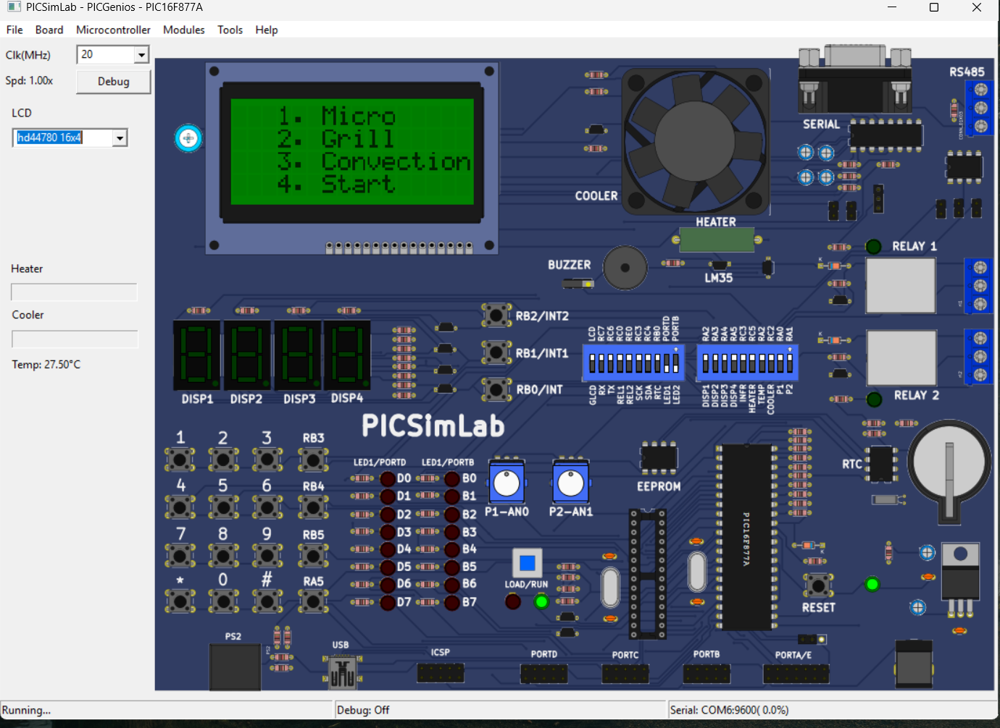
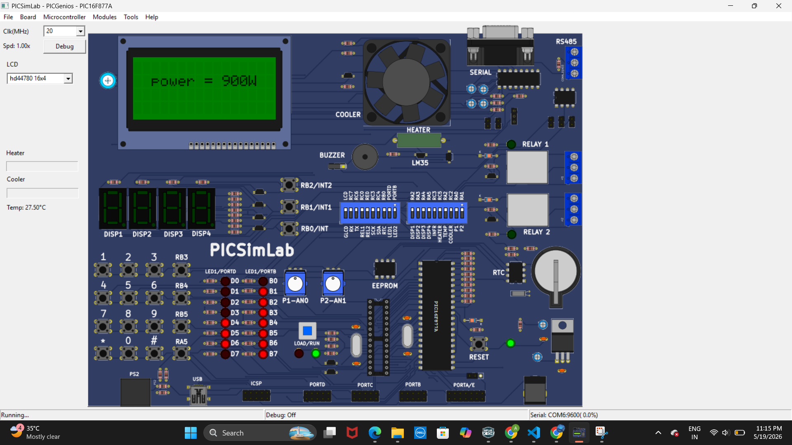
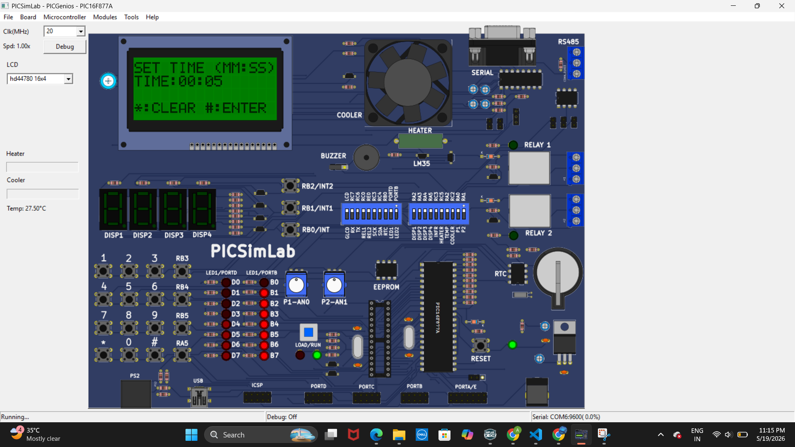
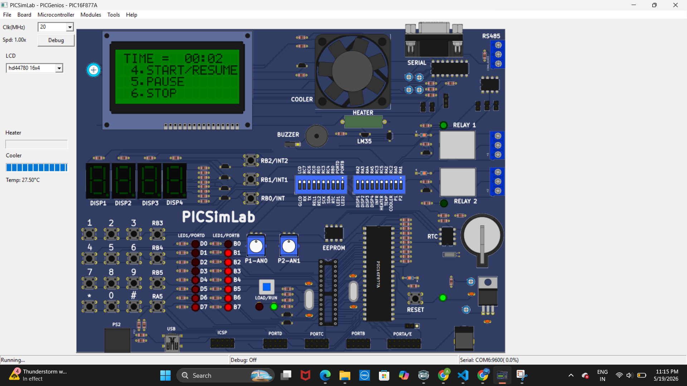
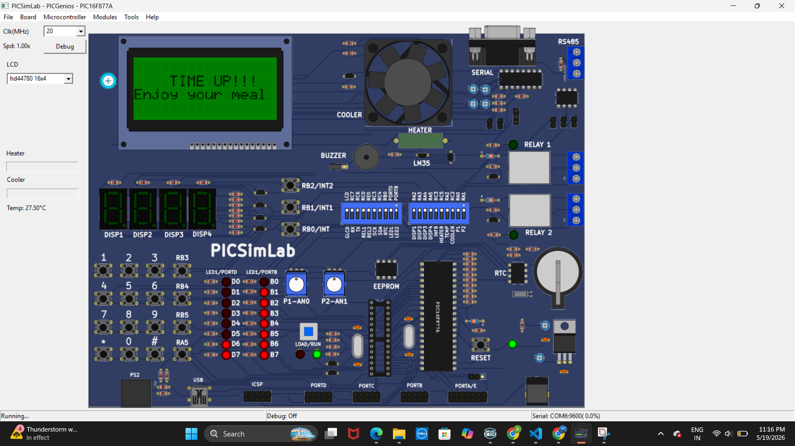

# Smart Microwave Oven using PIC16F877A

## Overview
The Smart Microwave Oven project is an embedded system application developed using the PIC16F877A microcontroller.  
The project is programmed using MPLAB X IDE with Embedded C and simulated using PICSimLab.

This system simulates the functionality of a modern microwave oven by providing menu-based cooking options, adjustable power levels, timer management, and operational controls such as Start, Stop, and Pause through a Matrix Keypad and CLCD interface.

---

## Features
- Power ON/OFF functionality
- Interactive menu-based navigation
- Multiple cooking modes
- Adjustable power levels
- Timer configuration and countdown
- Start, Stop, and Pause controls
- Meal completion notification
- CLCD-based user interface
- Matrix keypad input handling

---

## Technologies Used
- Embedded C
- PIC16F877A Microcontroller
- MPLAB X IDE
- XC8 Compiler
- PICSimLab for Simulation
- Matrix Keypad Interface
- CLCD Display Module

---

## Working Flow

The Smart Microwave Oven operates in the following sequence:

### 1. Power Screen Display
The system starts with a power screen displayed on the CLCD.


---

### 2. Main Menu
The main menu provides multiple cooking options for the user.



---

### 3. Power Selection
The user selects the desired cooking power level.



---

### 4. Timer Configuration
The cooking timer is configured according to the required cooking duration.



---

### 5. Timer Control
During operation, the user can:
- Start Timer
- Stop Timer
- Pause Timer



---

### 6. Meal Completion
After the timer finishes, the system displays:

### **"Enjoy Your Meal"**



---

## Project Structure

```text
microoven.X
│
├── Output/
│   ├── 1_Power Screen.png
│   ├── 2_Menu.png
│   ├── 3_Power.png
│   ├── 4_Timer.png
│   ├── 5_Pause.png
│   └── 6_Meal.png
│
├── clcd.c
├── clcd.h
├── isr.c
├── main.c
├── matrix_keypad.c
├── matrix_keypad.h
├── micro_oven.c
├── micro_oven.h
├── timers.c
├── timers.h
├── nbproject/
└── README.md
```

---

## Future Improvements
- IoT-based remote monitoring
- Mobile application control
- Temperature sensor integration
- Voice assistant support
- Touchscreen interface

---

## Author
### Anushka Shinde
Embedded Systems & VLSI Enthusiast